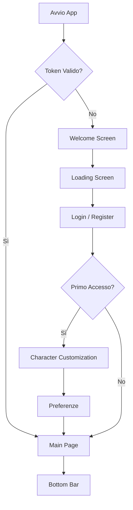

Ecco la **Specifica Tecnico-Funzionale** completa, riscritta e ottimizzata in formato **Markdown**. 
Puoi copiare e incollare questo blocco direttamente su GitHub, Notion, Jira o qualsiasi documentazione di progetto.

---

# Specifica Tecnico-Funzionale: App Healthcare & Fitness Gamificata

**Versione:** 1.0  
**Stato:** Analisi & Architettura  
**Obiettivo:** Strutturare un'app mobile (iOS/Android) che utilizzi meccanismi di gamification etica per incentivare l'attività fisica e l'educazione sanitaria.

---

## 1. Flusso Utente Logico (Decision Tree)

Il flusso non è lineare ma si ramifica in base allo stato dell'utente per ridurre l'attrito.

### Regole di Navigazione
- **Salto Onboarding**: Se l'utente ha già completato la personalizzazione in passato, il sistema salva un flag `onboarding_completed = true` e reindirizza direttamente alla Main Page dopo il Login.
- **Permessi Contestuali**: Notifiche, HealthKit/Google Fit e GPS vengono richiesti **solo** quando l'utente esegue la prima azione che li richiede (es. clicca su "Avvia Allenamento" o "Collega contapassi"), non durante il Login.

---

## 2. Specifiche UI e Componenti

### 2.1 Bottom Bar (Definitiva)
La barra inferiore contiene 5 voci. Le impostazioni escono dalla barra principale per ottimizzare lo spazio.

| # | Tab | Icona | Funzione principale |
| :--- | :--- | :--- | :--- |
| 1 | **Home** | 🏠 | Dashboard con Quest attivo, MOTD e widget attività giornaliera. |
| 2 | **Missioni** | ⚔️ | Lista filtrata di Quest (Giornalieri/Settimanali/Epici) e Quiz Sfida. |
| 3 | **Personaggio** | 🧙 | Vista unificata: Stats, Grafici, Badges e Inventario. |
| 4 | **Leaderboard** | 🏆 | Classifica per livello, tra amici e a squadre (Gilde). |
| 5 | **Impostazioni** | ⚙️ | Gestione preferenze, suoni, privacy e logout. |

### 2.2 Schermata "Quest e Quiz"
- **Quest**: Carta interattiva con barra di progressione circolare. Pulsanti contestuali:
  - *Avvia* (attiva il timer per esercizi a corpo libero).
  - *Collega* (sincronizza i passi dal sensore).
- **Quiz**: Modalità *Flashcard*. 
  - Feedback visivo immediato (Verde = Corretto, Rosso = Sbagliato).
  - In caso di errore, viene mostrata una **spiegazione didattica** obbligatoria (essenziale per la credibilità sanitaria).

### 2.3 Schermata Unificata "Personaggio / Stats / Inventario"
- **Header**: Avatar 3D/2D animato (tap per interazione vocale/testuale).
- **Mid (Stats)**: 
  - Numeri chiave: **Livello**, **XP totali**, **Giorni attivi**.
  - Grafico a barre/linee (ultimi 7 giorni). Tap su una barra per dettaglio giornaliero.
- **Footer (Sub-tabs interni)**:
  1. **Badge**: Griglia 3 colonne. Stato grigio (bloccato) / colorato (sbloccato). Tap per descrizione dello sblocco.
  2. **Inventario**: Diviso in [Estetici] e [Potenziamenti]. Pulsante "Usa/Equipaggia".

---

## 3. Modello Dati (Database Locale & Cloud)

Struttura consigliata per il backend (NoSQL come Firestore o SQL relazionale).

### Tabella: Utenti
| Campo | Tipo | Descrizione |
| :--- | :--- | :--- |
| `user_id` | String (PK) | UID univoco. |
| `email` | String | Login identifier. |
| `età` | Int | Calcolo FC max e categorie. |
| `obiettivo` | Enum | `perdere_peso`, `tonificare`, `resistenza`. |
| `livello_base` | Enum | `sedentario`, `moderato`, `attivo`. Influenza i target iniziali. |
| `onboarding_completed` | Bool | Salta la personalizzazione al prossimo login. |

### Tabella: Progressi Giornalieri
| Campo | Tipo | Descrizione |
| :--- | :--- | :--- |
| `progress_id` | String (PK) | - |
| `user_id` | String (FK) | Riferimento all'utente. |
| `data_riferimento` | Date | Giorno specifico. |
| `passi` | Int | Sincronizzati da sensori. |
| `minuti_attivi` | Int | Tempo di allenamento effettivo. |
| `xp_guadagnati` | Int | Somma XP delle missioni completate nel giorno. |

### Tabella: Inventario Utente
| Campo | Tipo | Descrizione |
| :--- | :--- | :--- |
| `inventory_id` | String (PK) | - |
| `item_type` | Enum | `skin` (estetico) o `powerup` (funzionale). |
| `quantità` | Int | Per i powerup (es. 3 scudi). |
| `equipaggiato` | Bool | True se la skin è attualmente indossata. |

---

## 4. Motore di Gamification (La Matematica)

### 4.1 Sistema di Progressione (XP & Livelli)
Per garantire longevità, la crescita è **esponenziale**:

- **Formula Livello**: 
  `XP_necessario_per_livello = 100 * (Livello_attuale ^ 1.5)`
- **Esempi**:
  - Livello 1 → 100 XP
  - Livello 5 → ~1.118 XP
  - Livello 20 → ~8.944 XP

### 4.2 Calcolo XP per Missione
Per evitare che l'utente si fermi a metà obiettivo, l'XP non è lineare:

- **Regola**: L'ultimo 20% dell'obiettivo (es. gli ultimi 2000 passi su 10.000) vale il **50% dell'XP totale** della missione (Effetto *End-Game*).

### 4.3 Valute (Economia Interna)
- **Monete d'Argento**: Ricompensa base. Spendibili per **Potenziamenti** (es. Scudo Streak).
- **Gemme/Stelle**: Ricompensa esclusiva per missioni settimanali completate al 100%. Spendibili per **Skin Rare**.
- **Regola Anticrisi**: Massimo 3 "Scudi Streak" contemporaneamente in inventario per evitare accumulo e banalizzazione della sfida.

### 4.4 Decadimento Streak
- Se l'utente salta un giorno, la serie si azzera automaticamente.
- **Eccezione**: L'utente può attivare un "Congelamento Streak" dall'inventario *prima* della mezzanotte del giorno di inattività.

---

## 5. Regole di Business (Backend Logic)

### 5.1 Progressive Overload (Adattamento Dinamico)
Il sistema non ha target fissi. Se l'utente completa tutti i quest giornalieri per 7 giorni di fila:

- Settimana 1: Target = 4.000 passi.
- Settimana 2: Target sale a 5.500 passi.
- ...fino al raggiungimento del target personalizzato (es. 10.000 passi).

### 5.2 Gestione Quiz e Ri-apprendimento
- Se l'utente sbaglia un quiz, la stessa domanda (contenuto) gli verrà riproposta in un giorno diverso, ma con una **domanda differente** sullo stesso tema.
- **Badge "Maestro"**: Completare 5 quiz consecutivi su una stessa categoria (es. Alimentazione) senza errori sblocca un badge settoriale.

### 5.3 Leaderboard Etica (Anti-Demotivazione)
- **Visibilità Limitata**: La classifica mostra solo la Top 10 e la posizione corrente dell'utente (nasconde gli ultimi classificati).
- **Reset Settimanale per Inattività**: Se un utente non effettua accessi per 3 giorni, il suo punteggio settimanale viene azzerato (impedendo a utenti inattivi di occupare posizioni alte).
- **Matchmaking per Fascia**: La classifica "Globale" confronta solo utenti nello stesso intervallo di Livello (es. Lv. 1-10).

---

## 6. Strategia di Notifiche Push (Engagement Funnel)

Struttura temporale per massimizzare la retention senza essere invasivi:

| Orario | Trigger | Messaggio | Azione |
| :--- | :--- | :--- | :--- |
| **08:00** | Inizio giornata | *"Il tuo corpo è pronto! La quest di oggi ti aspetta."* | Apri app → Quest |
| **14:00** | Progresso < 30% | *"Fai una pausa attiva di 5 minuti, ti mancano X minuti!"* | Apri app → Timer |
| **21:00** | Progresso < 100% | *"La tua streak è a rischio! Hai tempo fino a mezzanotte."* | Apri app → Completamento rapido |
| **+2 Giorni** | Inattività | *"Riprendi da dove hai lasciato! Ecco un Quest facile per ricominciare."* | Apri app → Onboarding di recupero |

---

## 7. Prossimi Passi (Sviluppo)

Abbiamo gettato le fondamenta. Per procedere con lo sviluppo, scegli una delle seguenti direttive:

> **Opzione A (Backend)**
> *Fornisci lo schema ER (Entity Relationship) dettagliato con chiavi primarie, esterne e indici per ottimizzare le query delle classifiche.*

> **Opzione B (Frontend)**
> *Fornisci la gerarchia dei componenti in React Native/Flutter, definendo gli State Manager (Provider/Bloc) per gestire l'inventario e lo streak in tempo reale.*

> **Opzione C (UX Writing)**
> *Fornisci il copywriting completo: testi dei pulsanti, messaggi di errore, descrizioni dei badge e frasi motivazionali per l'Avatar.*

---

**Nota di Progetto:** Ricorda di implementare una chiara **Informativa sulla Privacy** (GDPR) nella schermata di Registrazione, dato il trattamento di dati sensibili come battito cardiaco e peso.
